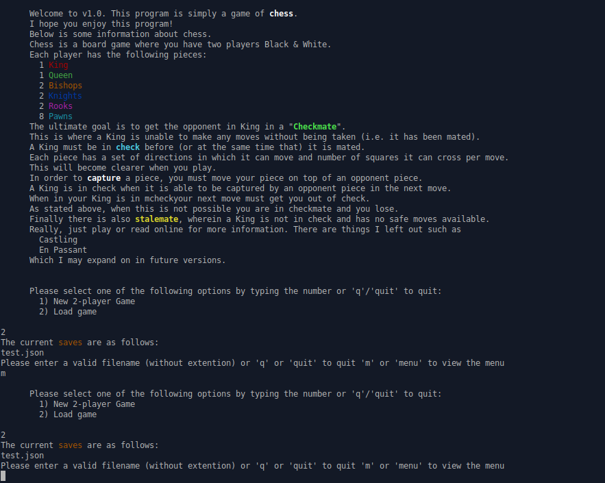
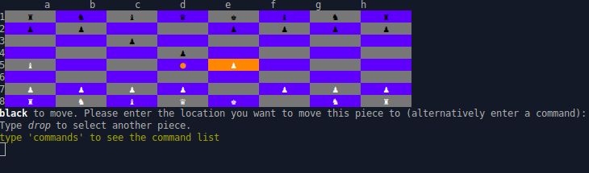

# Chess
This program is a simple command line chess game. It is currently **v1.0** and I have many things that I *want* to do, but I also really want to move on for now. In its current state it implements the essential rules of chess and has a simple structure that I, when I eventually come back, can add to without much issue. If you are interested please refer to discussion.md to see information about the project aims, issues, resources and more (especially if you're self-taught and about to undertake a similarly large project yourself)!

## Using the program
In order to use the program run *main.rb* file using *ruby {...}/main.rb*. The welcome text will introduce you to the program and to chess.

From there you can play a game of chess as the white player and play a normal chess game:

## Current Features
In its current form, it allows two players to play a normal game of chess by:
- Following the essential rules of chess
- Showing the available moves of a piece after selection
- Allowing a piece to be "dropped" before moving, so another piece can be selected
- Save and load previous games and continue from whence you left

## Future features
Some things that I have left incomplete or have yet to implement but intend to:
- More themes and the ability to change themes and piece symbols (ASCII code)
- Formatting module for better organisation of display elements (ANSI codes)
- Ability to view previous board states (i.e. see past moves)
- Alternative ways of moving (e.g. typing nf6 moves the correct knight to f6 without selection)
- Ability to start as black or randomise if the player is black/white
- AI to play against

A lot of these I have ideas for implementations right away (mixed complexity) but will have to be implemented at a later date.

## Comments
Please let me know if you have any tips or areas of improvements; cool things to implement or things to change!